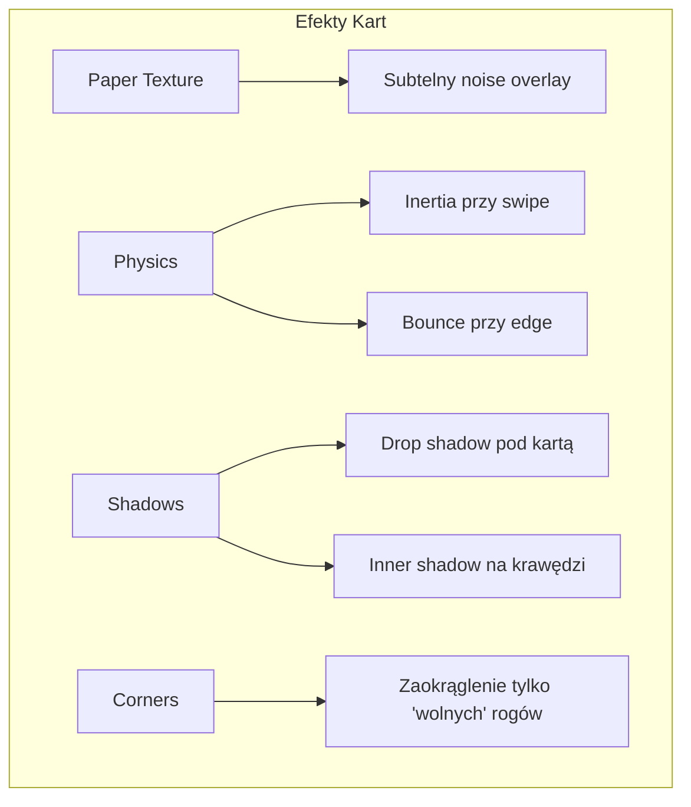

# Porównanie Nawigacji: Karty vs Tab Bar

**Data:** 2026-01-28
**Cel:** Pomóc w wyborze między ulepszonymi kartami a nowoczesnym Tab Bar

---

## Opcja 1: Ulepszone Karty (Paper Cards)

### Wizualizacja:

```
┌─────────────────────────────────────────┐
│  9:41                          🔋 100%  │
│                                         │
│   ┌───────────────────────────────┐    │  <- Floating header
│   │ Shopping List        [✓] [○] │    │
│   │ 3 items to buy                 │    │
│   └───────────────────────────────┘    │
│                                         │
│  ╔═══════════════════════════════════╗  │
│  ║  ╭─────────────────────────────╮  ║  │  <- Aktywna karta
│  ║  │                             │  ║  │     (zaokrąglenie tylko
│  ║  │  Mleko                 [ ]  │  ║  │      po prawej)
│  ║  │  Chleb                 [ ]  │  ║  │
│  ║  │                             │  ║  │
│  ║  │  + Add item...              │  ║  │
│  ║  ╰─────────────────────────────╯  ║  │
│  ║    │                              ║  │  <- Widoczna krawędź
│  ║    │  ╭──────────────────────╮    ║  │     następnej karty
│  ║    │  │ Todo               │    ║  │
│  ║    └──│ 5 tasks remaining  │    ║  │
│  ║       ╰──────────────────────╯    ║  │
│  ╚═══════════════════════════════════╝  │
│                                         │
│  ●━━━○ ○ ○ ○ ○ ○                        │  <- Page indicator
└─────────────────────────────────────────┘
```

### Efekty wizualne:



### Zalety:
- ✅ Unikalny, charakterystyczny wygląd
- ✅ Duża przestrzeń na treść (pełny ekran)
- ✅ Intuicyjne swipe gestures
- ✅ Efekt "wow" - zapada w pamięć
- ✅ Można pokazać 7 funkcji bez zagłuszania

### Wady:
- ❌ Wymaga nauki obsługi
- ❌ 7 kart to dużo (przeciążenie poznawcze)
- ❌ Trudność w dostępie do "ukrytych" kart
- ❌ Nie jest standardem iOS (użytkownicy mogą być zdezorientowani)
- ❌ Problemy z accessibility

---

## Opcja 2: Nowoczesny Tab Bar

### Wizualizacja:

```
┌─────────────────────────────────────────┐
│  9:41                          🔋 100%  │
│                                         │
│   ┌───────────────────────────────┐    │  <- Floating header
│   │ Shopping List        [✓] [○] │    │
│   │ 3 items to buy                 │    │
│   └───────────────────────────────┘    │
│                                         │
│  ┌───────────────────────────────────┐  │
│  │                                   │  │  <- Główna zawartość
│  │  Mleko                     [ ]   │  │
│  │  Chleb                     [ ]   │  │
│  │  Jajka                     [ ]   │  │
│  │                                   │  │
│  │  + Add item...                    │  │
│  │                                   │  │
│  └───────────────────────────────────┘  │
│                                         │
│  ┌─────────┬─────────┬─────────┬──────┐ │  <- Tab Bar
│  │   🛒    │   ✅    │   👪    │  ⋯   │ │
│  │ Shopping│  Tasks  │ Family  │ More │ │
│  └─────────┴─────────┴─────────┴──────┘ │
└─────────────────────────────────────────┘
```

### Wariant A: 3 przyciski (prostszy):

```
┌─────────────────────────────────────────┐
│                                         │
│  ┌───────────────────────────────────┐  │
│  │         GŁÓWNA ZAWARTOŚĆ          │  │
│  └───────────────────────────────────┘  │
│                                         │
│  ┌─────────┬─────────┬────────────────┐ │
│  │   🛒    │   ✅    │       👪        │ │
│  │ Shopping│  Tasks  │    Household    │ │
│  └─────────┴─────────┴────────────────┘ │
└─────────────────────────────────────────┘
```

### Wariant B: 4 przyciski z "More":

```
┌─────────────────────────────────────────┐
│                                         │
│  ┌───────────────────────────────────┐  │
│  │         GŁÓWNA ZAWARTOŚĆ          │  │
│  └───────────────────────────────────┘  │
│                                         │
│  ┌────────┬────────┬────────┬─────────┐ │
│  │   🛒   │   ✅   │   📋   │    👪   │ │
│  │ Shopping│ Tasks │ Backlog│ Household│ │
│  └────────┴────────┴────────┴─────────┘ │
└─────────────────────────────────────────┘
```

### Zalety:
- ✅ Standard iOS - użytkownicy od razu wiedzą jak używać
- ✅ Doskonała accessibility (VoiceOver, Switch Control)
- ✅ Szybki dostęp do wszystkich funkcji (1 tap)
- ✅ Łatwiejsza implementacja i mniej bugów
- ✅ Lepsza wydajność (nie renderujemy wszystkich kart naraz)
- ✅ Apple HIG compliant

### Wady:
- ❌ Mniej "wow factor"
- ❌ Ograniczona liczba zakładek (max 5)
- ❌ Mniej przestrzeni na treść (tab bar zajmuje miejsce)
- ❌ Brak gestów swipe między ekranami

---

## Opcja 3: Hybryda (Rekomendowana)

### Wizualizacja:

```
┌─────────────────────────────────────────┐
│  9:41                          🔋 100%  │
│                                         │
│   ┌───────────────────────────────┐    │
│   │ Shopping List        [✓] [○] │    │
│   │ 3 items to buy                 │    │
│   └───────────────────────────────┘    │
│                                         │
│  ┌───────────────────────────────────┐  │
│  │                                   │  │
│  │  Mleko                     [ ]   │  │
│  │  Chleb                     [ ]   │  │
│  │                                   │  │
│  │  + Add item...                    │  │
│  │                                   │  │
│  └───────────────────────────────────┘  │
│                                         │
│  ┌───────────────────────────────────┐  │
│  │  🛒        ✅        👪      [⋯]  │  │  <- Duże przyciski
│  │Shopping   Tasks   Household  More │  │     (ikona + tekst)
│  └───────────────────────────────────┘  │
└─────────────────────────────────────────┘
```

### "More" menu (po tapnięciu [⋯]):

```
┌─────────────────────────────────────────┐
│                                         │
│  ┌───────────────────────────────────┐  │
│  │         GŁÓWNA ZAWARTOŚĆ          │  │
│  └───────────────────────────────────┘  │
│                                         │
│  ╔═══════════════════════════════════╗  │
│  ║  ┌─────────────────────────────┐  ║  │  <- Sheet/Overlay
│  ║  │  📋 Backlog          12     │  ║  │
│  ║  │  🔄 Recurring         5     │  ║  │
│  ║  │  📁 Areas             3     │  ║  │
│  ║  │  ⚙️ Settings              │  ║  │
│  ║  └─────────────────────────────┘  ║  │
│  ╚═══════════════════════════════════╝  │
│                                         │
│  ┌───────────────────────────────────┐  │
│  │  🛒        ✅        👪      [⋯]  │  │
│  └───────────────────────────────────┘  │
└─────────────────────────────────────────┘
```

### Zalety:
- ✅ Najważniejsze funkcje na wierzchu (3 główne)
- ✅ Mniej przeciążenia poznawczego
- ✅ Pozostałe funkcje łatwo dostępne przez "More"
- ✅ Można dodać badge count do każdego przycisku
- ✅ Zachowuje trochę "unikalności" przez duże przyciski
- ✅ Łatwo rozszerzalne w przyszłości

### Wady:
- ❌ Wymaga 2 tapnięć dla mniej używanych funkcji
- ❌ "More" może być pomijane przez użytkowników

---

## Porównanie UX

| Kryterium | Karty (7) | Tab Bar (3-4) | Hybryda (3+1) |
|-----------|-----------|---------------|---------------|
| **Łatwość nauki** | ⭐⭐ | ⭐⭐⭐⭐⭐ | ⭐⭐⭐⭐ |
| **Szybkość dostępu** | ⭐⭐⭐ | ⭐⭐⭐⭐⭐ | ⭐⭐⭐⭐ |
| **Czytelność** | ⭐⭐ | ⭐⭐⭐⭐⭐ | ⭐⭐⭐⭐ |
| **Unikalność** | ⭐⭐⭐⭐⭐ | ⭐⭐ | ⭐⭐⭐ |
| **Accessibility** | ⭐⭐ | ⭐⭐⭐⭐⭐ | ⭐⭐⭐⭐ |
| **Skalowalność** | ⭐⭐⭐⭐ | ⭐⭐ | ⭐⭐⭐ |
| **Apple HIG** | ⭐⭐ | ⭐⭐⭐⭐⭐ | ⭐⭐⭐⭐ |

---

## Moja Rekomendacja

### Dla tej aplikacji polecam **Hybrydę (Opcja 3)**:

**Powody:**
1. **Shopping, Tasks, Household** to główne funkcje (80% użycia)
2. **Backlog, Recurring, Areas, Settings** są używane rzadziej
3. Duże przyciski z ikonami są czytelniejsze niż małe ikony w standardowym Tab Bar
4. Badge count na przyciskach (np. "3" na Tasks) jest bardzo przydatny
5. Łatwiej zaimplementować niż fizykę kart, a wygląda nowocześniej

### Alternatywnie, jeśli zależy Ci na prostocie:
**Tab Bar z 4 przyciskami (Opcja 2)** - standard iOS, zero nauki dla użytkowników.

### Jeśli chcesz się wyróżnić:
**Ulepszone Karty (Opcja 1)** - ale wymaga to więcej pracy i testów użyteczności.

---

## Co dalej?

Wybierz jedną z opcji, a przygotuję:
- Szczegółowy plan implementacji
- Kod źródłowy zmian
- Aktualizację dokumentacji
