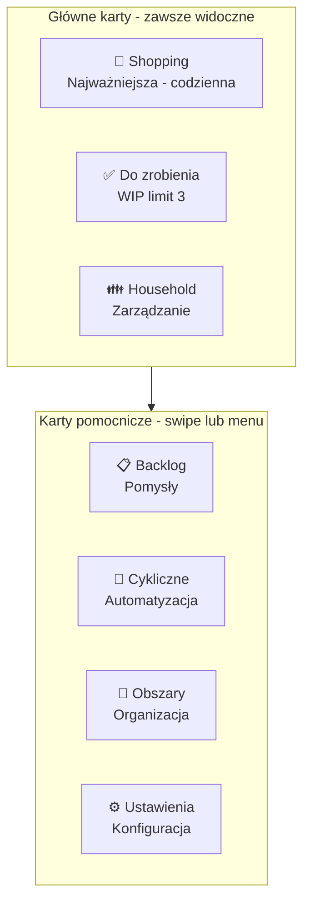
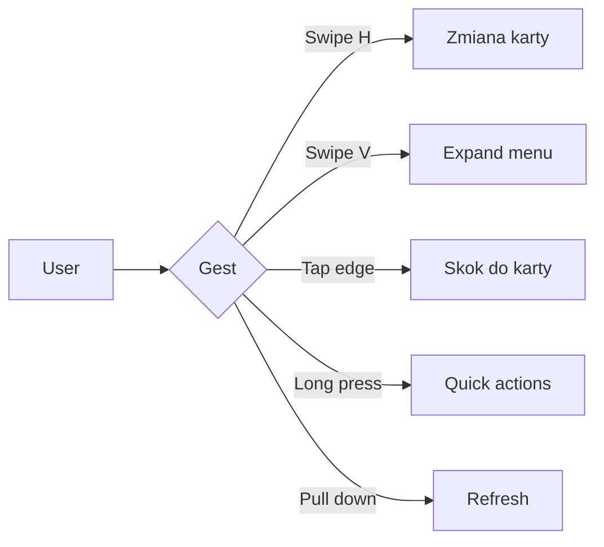
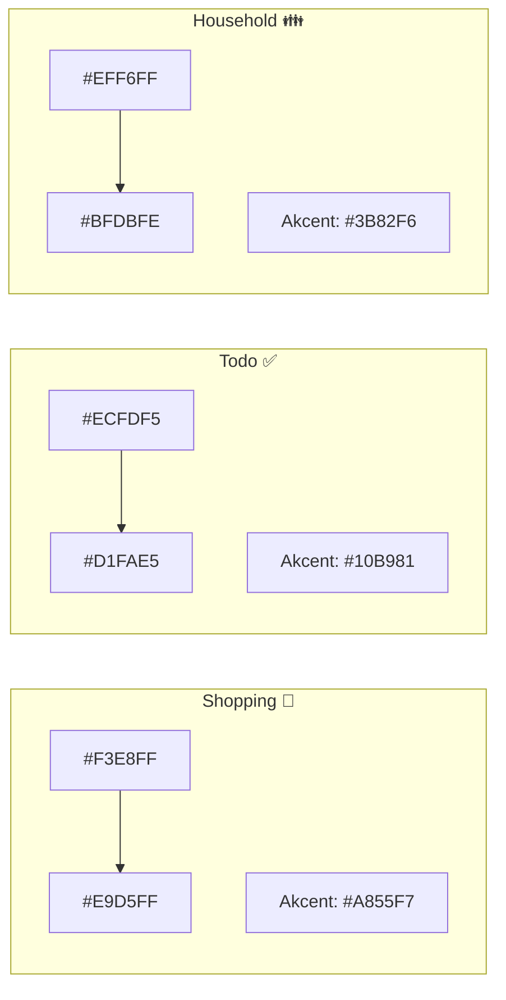
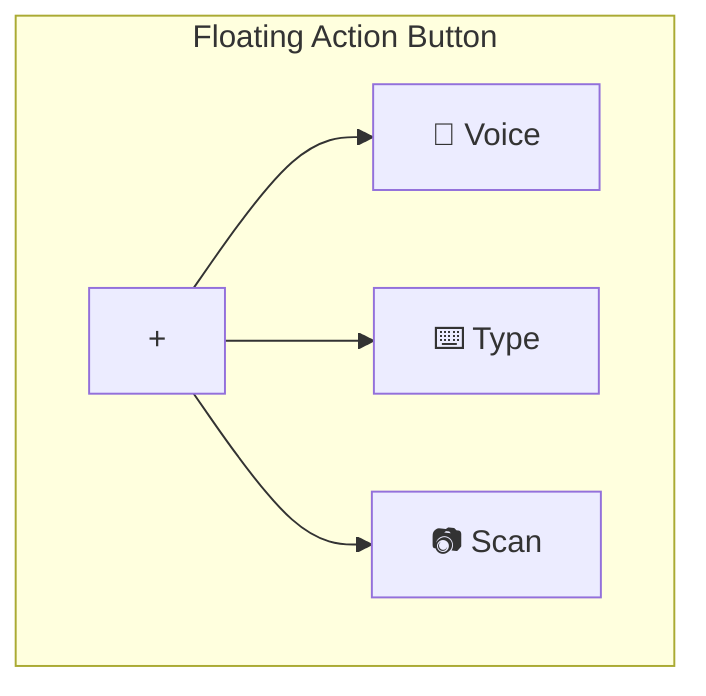

# Propozycja Redesignu UI - Family To-Do App

**Data:** 2026-01-28
**Cel:** Uczynić aplikację bardziej przyjazną, piękną i intuicyjną

---

## 1. Analiza Obecnych Problemów UX/UI

### Problemy identyfikacyjne:

| Problem | Wpływ na UX | Priorytet |
|---------|-------------|-----------|
| **7 kart to za dużo** | Przeciążenie poznawcze, trudna nawigacja | Wysoki |
| **Brak wizualnej hierarchii** | Wszystkie karty mają ten sam priorytet | Wysoki |
| **Małe krawędzie kart (6pt)** | Trudne trafianie w edge-tap | Średni |
| **Jednolity layout CardPageView** | Brak różnicowania funkcji kart | Średni |
| **Brak quick actions** | Wiele kliknięć do częstych operacji | Średni |
| **Nieczytelne avatary** | Inicjały zamiast kolorów/kolorów | Niski |
| **Staticzny header** | Brak kontekstu w nagłówku | Niski |

---

## 2. Propozycje Usprawnień Nawigacji i Struktury Kart

### 2.1 Reorganizacja Kart - Model "3+1"

Zamiast 7 równorzędnych kart, proponuję **hierarchiczną strukturę**:



**Zmiany w nawigacji:**
- **Główne 3 karty**: Shopping, Todo, Household - pełny width
- **Pozostałe 4 karty**: Dostępne przez:
  - Swipe w górę na footerze (expand menu)
  - Lub: Long-press na footerze (grid menu)
  - Lub: "More" button w headerze

### 2.2 Nowy System Nawigacji



**Quick Actions (long-press na karcie):**
- Shopping: "Dodaj szybko" (voice input)
- Todo: "Zrób teraz" (timer 25min)
- Household: "Zaproś osobę"

---

## 3. Redesign Kolorystyki i Typografii

### 3.1 Nowa Paleta Kolorów - "Soft Aurora"



**Szczegóły kolorystyczne:**

| Element | Obecnie | Propozycja | Uzasadnienie |
|---------|---------|------------|--------------|
| **Shopping** | Fioletowy | `lavender-100` → `lavender-200` | Spokojniejszy, mniej agresywny |
| **Todo** | Zielony | `emerald-50` → `emerald-100` | Świeży, motywujący |
| **Household** | Niebieski | `blue-50` → `blue-200` | Zaufany, stabilny |
| **Backlog** | Żółty | `amber-50` → `amber-100` | Neutralny, nie pilny |
| **Recurring** | Pomarańczowy | `orange-50` → `orange-100` | Ciepły, automatyczny |
| **Areas** | Miętowy | `teal-50` → `teal-100` | Organizacyjny |
| **Settings** | Kremowy | `slate-100` → `slate-200` | Neutralny, profesjonalny |

### 3.2 System Typografii

**Obecnie:** Systemowe fonty, różne rozmiary

**Propozycja:** Spójny typograficzny system

```swift
enum Typography {
    // Nagłówki kart
    static let cardTitle = Font.system(size: 28, weight: .bold, design: .rounded)
    static let cardSubtitle = Font.system(size: 15, weight: .medium, design: .default)

    // Zadania
    static let taskTitle = Font.system(size: 17, weight: .semibold, design: .default)
    static let taskDetail = Font.system(size: 13, weight: .regular, design: .default)

    // Input
    static let inputText = Font.system(size: 16, weight: .regular, design: .default)

    // Etykiety
    static let badge = Font.system(size: 11, weight: .bold, design: .rounded)
    static let count = Font.system(size: 13, weight: .bold, design: .rounded)
}
```

**Zmiany:**
- Użycie `.rounded` dla nagłówków (przyjaźniejsze)
- Większy kontrast między tytułem a detalem
- Spójne wagi fontów (bold/semibold/regular)

---

## 4. Ulepszenia Animacji i Mikro-interakcji

### 4.1 Animacje Kart

**Obecnie:** Podstawowa animacja spring

**Propozycja:** Bardziej wyrafinowane animacje

```swift
enum CardAnimations {
    // Przejście między kartami
    static let cardSwitch = Animation.spring(
        response: 0.45,
        dampingFraction: 0.75,
        blendDuration: 0.1
    )

    // Wejście nowej karty
    static let cardEnter = Animation.spring(
        response: 0.5,
        dampingFraction: 0.6
    )

    // Parallax podczas swipe
    static let parallax = Animation.easeOut(duration: 0.3)
}
```

**Efekty:**
- **Parallax depth**: Tło przesuwa się wolniej niż zawartość
- **Scale effect**: Aktywna karta 1.0, sąsiednie 0.95
- **Blur transition**: Sąsiednie karty lekko rozmyte

### 4.2 Mikro-interakcje

| Element | Obecnie | Propozycja |
|---------|---------|------------|
| **Checkbox** | Proste scale | Scale + bounce + checkmark draw |
| **Dodawanie zadania** | Rotation 90° | Scale up + shimmer + success pulse |
| **Usuwanie** | X button | Swipe + fade + undo toast |
| **WIP limit** | Alert | Shake + badge pulse + tooltip |
| **Empty state** | Static text | Animowana ilustracja + CTA |

### 4.3 Haptyka

**Rozszerzona obsługa haptyki:**

```swift
enum EnhancedHaptics {
    static func cardChanged() {
        // Light + pattern
        let generator = UIImpactFeedbackGenerator(style: .light)
        generator.impactOccurred(intensity: 0.7)
        DispatchQueue.main.asyncAfter(deadline: .now() + 0.05) {
            generator.impactOccurred(intensity: 0.3)
        }
    }

    static func taskCompleted() {
        // Success pattern
        let generator = UINotificationFeedbackGenerator()
        generator.notificationOccurred(.success)
    }

    static func limitReached() {
        // Warning
        let generator = UINotificationFeedbackGenerator()
        generator.notificationOccurred(.warning)
    }
}
```

---

## 5. Nowe Funkcje UX

### 5.1 Smart Header

Header zmienia się dynamicznie w zależności od kontekstu:

```swift
struct SmartHeaderView: View {
    let cardKind: CardKind
    let stats: CardStats

    var body: some View {
        HStack {
            VStack(alignment: .leading, spacing: 2) {
                Text(cardKind.title)
                    .font(.headline)

                // Dynamiczny podtytuł
                Text(dynamicSubtitle)
                    .font(.caption)
                    .foregroundStyle(.secondary)
            }

            Spacer()

            // Context-aware actions
            switch cardKind {
            case .todo:
                if stats.isOverLimit {
                    WIPBadge(count: stats.remainingSlots)
                }
            case .shopping:
                if stats.hasRestockSuggestions {
                    RestockIndicator(count: stats.restockCount)
                }
            default:
                EmptyView()
            }

            // Settings zawsze dostępne
            SettingsButton()
        }
    }
}
```

### 5.2 Floating Action Button (FAB)

Zamiast input field na dole - **kontekstowy FAB**:



**Zachowanie:**
- Tap: Otwiera szybkie dodawanie (voice-first)
- Long-press: Menu opcji
- Drag: Przesunięcie (dostępne wszędzie)

### 5.3 Progress Rings

Wizualizacja postępu na każdej karcie:

```swift
struct CardProgressRing: View {
    let completed: Int
    let total: Int

    var body: some View {
        ZStack {
            Circle()
                .stroke(Color.secondary.opacity(0.2), lineWidth: 3)

            Circle()
                .trim(from: 0, to: CGFloat(completed) / CGFloat(total))
                .stroke(
                    AngularGradient(
                        colors: gradientColors,
                        center: .center
                    ),
                    style: StrokeStyle(lineWidth: 3, lineCap: .round)
                )
                .rotationEffect(.degrees(-90))
                .animation(.spring(response: 0.6), value: completed)
        }
        .frame(width: 24, height: 24)
    }
}
```

### 5.4 Smart Empty States

**Zamiast "Everything is done!" - angażujące empty states:**

| Karta | Pusty stan | CTA |
|-------|------------|-----|
| Shopping | "Twoja lista jest pusta 🎉" | "Dodaj pierwszy produkt" |
| Todo | "Wszystko zrobione! 🌟" | "Weź kolejne z backlogu" |
| Backlog | "Brak pomysłów? 💡" | "Dodaj pierwszy pomysł" |
| Recurring | "Zautomatyzuj zadania 🔄" | "Utwórz pierwsze cykliczne" |

### 5.5 Contextual Swipe Actions

**Bardziej zaawansowane swipe:**

```swift
.taskRowStyle { task in
    .swipeActions(edge: .leading) {
        // Szybkie akcje
        Button { promoteToNext(task) } label: {
            Label("Do zrobienia", systemImage: "arrow.up")
        }
        .tint(.green)

        Button { snooze(task) } label: {
            Label("Przypomnij", systemImage: "clock")
        }
        .tint(.orange)
    }
    .swipeActions(edge: .trailing) {
        Button(role: .destructive) { delete(task) } label: {
            Label("Usuń", systemImage: "trash")
        }

        Button { edit(task) } label: {
            Label("Edytuj", systemImage: "pencil")
        }
        .tint(.indigo)
    }
}
```

---

## 6. Plan Wdrożenia

### Faza 1: Quick Wins (1 tydzień)
- [ ] Zmiana typografii (Typography enum)
- [ ] Ulepszenie mikro-interakcji (checkbox, add button)
- [ ] Smart empty states
- [ ] Rozszerzona haptyka

### Faza 2: Struktura (2 tygodnie)
- [ ] Reorganizacja kart (3+1 model)
- [ ] Nowy system nawigacji (expand menu)
- [ ] Smart header
- [ ] Progress rings

### Faza 3: Polish (1 tydzień)
- [ ] Nowa kolorystyka
- [ ] Animacje parallax
- [ ] FAB
- [ ] Contextual swipe actions

### Faza 4: Testing
- [ ] User testing z 5 osobami
- [ ] A/B testy (stary vs nowy layout)
- [ ] Analiza metryk (engagement, task completion)

---

## 7. Mockupy Konceptualne

### Nowa Struktura Kart:

```
┌─────────────────────────────────────────┐
│  Shopping List              [⚙️] [👤]  │  ← Smart header z indicatorami
│  3 items to buy                         │
├─────────────────────────────────────────┤
│                                         │
│  ┌─────────────────────────────────┐   │
│  │ ☐ Mleko                    [WO] │   │  ← Task z avatar stack
│  │    2 litry                          │
│  └─────────────────────────────────┘   │
│  ┌─────────────────────────────────┐   │
│  │ ☐ Chleb                    [AN] │   │
│  │    1 bochenek                       │
│  └─────────────────────────────────┘   │
│                                         │
│         ┌───┐                          │
│         │ + │  ← FAB                   │
│         └───┘                          │
│                                         │
├─────────────────────────────────────────┤
│  ●━━━○ ○ ○  [⋯]                        │  ← Footer z "more"
└─────────────────────────────────────────┘
```

### Expanded Menu:

```
┌─────────────────────────────────────────┐
│                                         │
│     ┌─────────┐  ┌─────────┐           │
│     │ Shopping│  │  Todo   │           │
│     │   🛒    │  │   ✅    │           │
│     └─────────┘  └─────────┘           │
│                                         │
│     ┌─────────┐  ┌─────────┐           │
│     │Household│  │ Backlog │           │
│     │   👪    │  │   📋    │           │
│     └─────────┘  └─────────┘           │
│                                         │
│     ┌─────────┐  ┌─────────┐           │
│     │Recurring│  │  Areas  │           │
│     │   🔄    │  │   📁    │           │
│     └─────────┘  └─────────┘           │
│                                         │
│         ┌─────────┐                    │
│         │Settings │                    │
│         │   ⚙️    │                    │
│         └─────────┘                    │
│                                         │
└─────────────────────────────────────────┘
```

---

## Podsumowanie

Główne obszary poprawy:

1. **Uproszczona nawigacja** - 3 główne karty zamiast 7
2. **Spójniejsza estetyka** - nowa paleta "Soft Aurora"
3. **Lepsze feedbacki** - rozszerzona haptyka i animacje
4. **Inteligentniejszy UI** - kontekstowe nagłówki i akcje
5. **Nowoczesne wzorce** - FAB, progress rings, smart empty states

Te zmiany powinny znacząco poprawić:
- **Użyteczność** - mniej kliknięć do celu
- **Estetykę** - spójniejszy, nowocześniejszy wygląd
- **Engagement** - przyjemniejsze interakcje
- **Dostępność** - lepsza hierarchia i feedback
